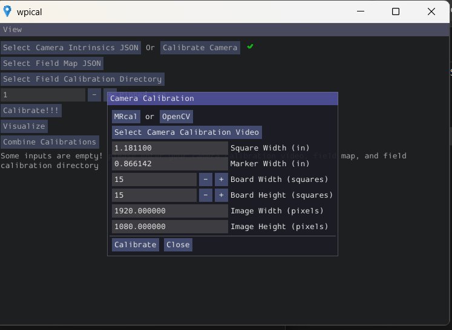

# How to Generate a Field Map with WPICal

.fmap files are for Limelight only, we don't use them in PhotonVision

Charuco Board is used to calibration. Same details apply to photon vision camera calibration.

Camera Calibration Details:
- Pattern Spacing / Square Width (in): 1.1811
- Marker Size / Marker Width (in): 0.866142
- Board Width (squares): 15
- Board Height (squares): 15
