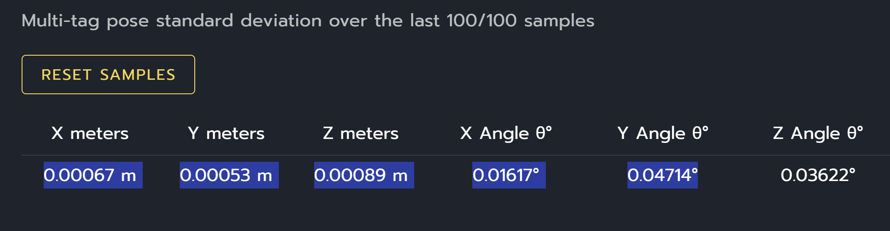

# Vision Log Analyzer

Interactive Streamlit dashboard for analyzing WPILib `.wpilog` files from the vision subsystem.

## Setup (one time)

Install Python 3: https://www.python.org/downloads/

```
python -m pip install streamlit plotly
```

## Run

```
python -m streamlit run tools/vision-analyzer/analyze.py
```

A browser window opens. Enter the path to a `.wpilog` file in the sidebar and press Enter.
The log is cached in memory — switching tabs is instant.

## Tabs

| Tab | Contents |
|-----|----------|
| **Summary** | Per-camera metrics table + stationary quality score |
| **Health** | FPS timeline, connection status, result latency distribution |
| **Acceptance** | Rolling acceptance rate over time, rejection breakdown (velocity / boundary / ambiguity) |
| **Geometry** | Distance, tag area, Z-height, ambiguity histograms |
| **Field** | Field coverage map — tag detection frequency + robot path |
| **Motion** | Acceptance rate bucketed by robot motion state (requires drivetrain speed signals) |

## Key metric: stationary quality score

```
stationary_quality = accepted / raw   (loops where |v| < 0.2 m/s AND |ω| < 0.3 rad/s only)
```

Removes motion as a confounder. > 80% is healthy; < 60% at rest points to a calibration
or hardware problem independent of robot behaviour.

## Getting log files

```bash
# From roboRIO over SSH
scp admin@10.14.5.2:/home/lvuser/logs/*.wpilog logs/
```

## Signal format

The dashboard auto-detects old vs. new log format. New-format logs (from this codebase)
include raw pre-filter data (`RawEstimatedPoses`, `RawAmbiguities`, etc.) and computed
outputs (`AcceptedPoses`, `RejectedBoundary`, etc.) under `RealOutputs/Vision/<camera>/`.

## AdvantageScope native signals

The robot also logs computed metrics viewable directly in AdvantageScope's Line Graph
and Statistics tabs:

- `Vision/<camera>/AcceptanceRatePercent` — per-loop acceptance rate (0–100)
- `Vision/<camera>/ResultsPerLoop` — raw estimates received this loop
- `Vision/<camera>/LatencyMsLatest` — coprocessor-to-robot latency of most recent result

## Probe mode (signal dump)

```
python tools/vision-analyzer/analyze.py --probe path/to/log.wpilog
```

## Legacy CLI mode

```
python tools/vision-analyzer/analyze.py path/to/log.wpilog
```

Prints a summary to stdout and writes a lightweight HTML file (summary table only).
For the full interactive dashboard, use `streamlit run` instead.


# TODO
- export high level vision analysis data to .csv and .md files for quick analysis and visual comparison.
- identify how to compare non-identical runs (same auto routine but vastly different behavior because of PID/Vision changes). filter out noise and focus in on camera/vision differences.
- accepted poses over time chart, with average accepted poses per second (do we already have this metric?). what is a useful bucket? 1s?
- It would be potentially insightful to show velocity rejected poses on the field tab so i can consider if our velocity threshold is too conservativve.
- It would be helpful to add a table to view ambigous and out of bounds estimates that were rejected. shown on a field (not the same field or able to toggle off) can help me better understand why they were rejected.
- Left camera is out of focus likely. right camera is sharper.
- figure out what this is exactly: Multi-tag pose standard deviation over the last 100/100 samples

- would it be useful to give a left and right camera "trust" or weight output over time? would it be useful to graph the standard deviations over time?
- can we output the robot's velocity? is there a bug with that? i find it odd that none of my AKit logs had robot velocity.
- Can i get the swerve drive in Akit logs easily? if not can i get velocity from the cameras?
- add a button to download the latest log from the robot into the /logs folder of the repo, it should have a suffix text box where i can add a note that gets appended like "_my_note". normal char's and spaces only. it should then auto load that file after downloading it. proper error handling if the robot can't be reached.
- improve the time selection mechanism. add a text box to allow manually typing in the exact time to slice on either side. add callouts at the mode transitions so i can immediately tell what those times are. even better if i can click something at the transition to perfectly start/end the slice there.